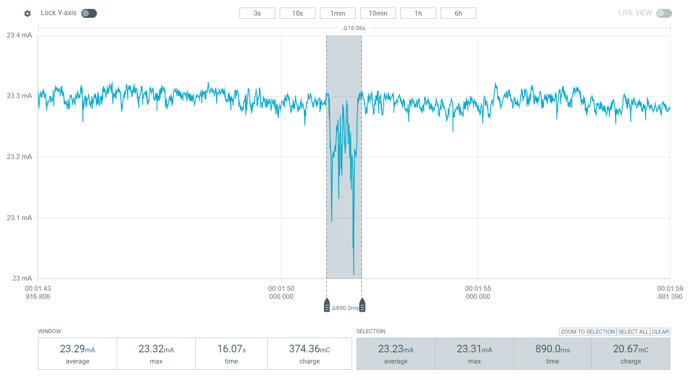
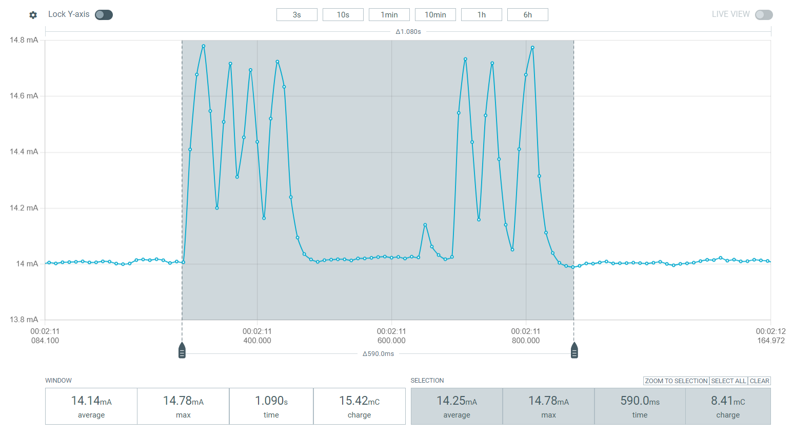

# Motion Sensors

|Sensor Model	| Type	| Idle Current	| Active Current	| Trigger Duration|
|---|---|---|---|---|
| HLK-LD102     | uwave	| 12mA	        | 12mA	            | __ |
| HLK-LD105	    | uwave	| 23mA          | 23mA	            | __ |
| HLK-LD1020	| uwave | 14mA	        | 14mA	            | __ |
| HLK-LD1030	| uwave | 100µA	        | 450µA             | __ |
| AM312	        | PIR	| 14µA	        | 18µA	            | ~3 seconds	3mA (120ms)
| SR602	        | PIR	| 20µA	        | ~20µA              | __ |

## HLK-LD102
This module is continuously active, resulting in higher current consumption.
It averages approximately 12mA during operation.

*Figure 1. LD102 in active mode. The gray area indicates triggered signals.*

## HLK-LD105
This continuously active module consumes significant power with an average current draw of 23mA.

*Figure 2. LD105 in active mode. The gray area indicates triggered signals.*

## HLK-LD1020
Operating in continuous active mode, this sensor averages ~14mA current consumption.
Triggered signals typically last ~600ms.

*Figure 3. LD1020 in active mode. The gray area indicates triggered signals.*

## HLK-LD1030

Idle Mode:
- Average consumption: ~100µA
- Peak spikes: ~106µA
- Spike interval: ~4.3 seconds

*Figure 4. LD1030 in idle state*

Triggered Signals:
- Average consumption: ~450µA
- Peak spikes: ~1.10mA
- Signal duration: ~670ms

*Figure 5. LD1030 triggered signals*

## AM312 (PIR Sensor)
- Idle consumption: 14µA
- Active consumption: 18µA (average duration: 3 seconds)
- Power-up spike: ~3mA for 120ms

*Figure 6. AM312 in active mode. The gray area indicates triggered signals.*

## SR602 (PIR Sensor)
- Average consumption: 20µA
- Power-up spike: ~2mA for ~60ms
- Note: Triggered state is difficult to distinguish from idle state

*Figure 7. SR602 in active mode.*
